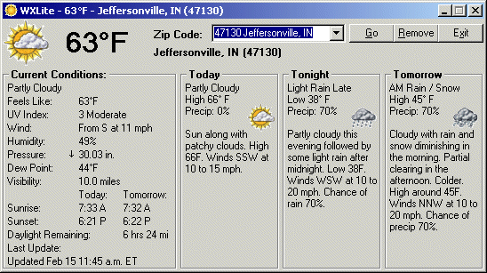



## WXLite

### Description

Gather detailed weather information from weather.com and display it in a condensed, easy to read format. Includes 36 hour forcast information. The program utilizes a reference to "Windows XML, version 2.0" to complete the task. Also includes a module that allows for "form fade in/out". This fade module was taken from another post here on PSC but I can not remember who posted it (sorry I can't give you credit for your work by name). Also makes use of a simple text file to track all zip codes you enter into the program, and will remember the last zip that you looked at and display it automatically when the program is run again. One fault of the program (or maybe it's the website, I don't know) is that when refreshing, the program will display the same data as previously even though the actual information on the web site has been updated (website updates approximately every 20 minutes). If anyone can figure out how to get the XML object to get a true refresh, please post the modified project to PSC for all to enjoy! Hope you enjoy this project, it's been fun putting it together.
 
### More Info
 

             |
---                |---
**Submitted On**   |2005-02-15 11:57:30
**By**             |[Christopher Reason](https://github.com/Planet-Source-Code/PSCIndex/blob/master/ByAuthor/christopher-reason.md)
**Level**          |Intermediate
**User Rating**    |5.0 (20 globes from 4 users)
**Compatibility**  |VB 6\.0
**Category**       |[Miscellaneous](https://github.com/Planet-Source-Code/PSCIndex/blob/master/ByCategory/miscellaneous__1-1.md)
**World**          |[Visual Basic](https://github.com/Planet-Source-Code/PSCIndex/blob/master/ByWorld/visual-basic.md)
**Archive File**   |[WXLite1853182152005\.zip](https://github.com/Planet-Source-Code/christopher-reason-wxlite__1-58922/archive/master.zip)

